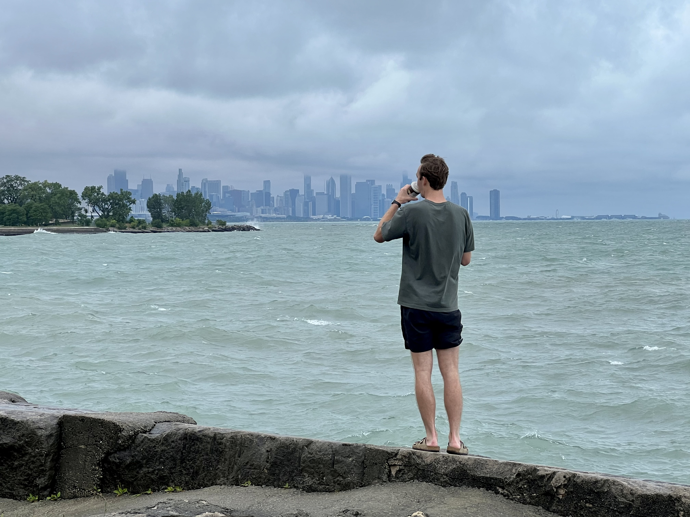

I'm a PhD student in [Public Policy](https://www.heinz.cmu.edu/) and [Machine Learning](https://www.ml.cmu.edu/) at Carnegie Mellon University. I'm motivated by problems that affect cities, specifically crime, transportation, and education policy. My research focuses on how machine learning can improve policy-relevant research on these types of problems by unlocking important information captured in unstructured data (e.g., text, video, mobility data). The goal is to do better social science, so we can make cities safer and more equitable. 

For more info, see my (hopefully up-to-date) [CV](/assets/files/cv.pdf). You can also reach me at lcrowl [at] cmu.edu. 

## Research Interests

  

    <strong>Policy</strong> 
    - Crime 
    - Transportation 
    - Education
  

  
  

    <strong>Machine Learning</strong> 
    - Model-based hypothesis generation 
    - Interpretability 
    - Causal inference 
    - Natural language processing
  

## Rough Timeline

Most of my interests amd personality come from **Chicago**, where I grew up in the Hyde Park neighborhood. Those experiences shaped my interest in helping cities work better. Chicago's the best.

For undergrad, I studied math & statistics at **Carleton College** in **Minnesota**. While there, I tried to balance out my math workload with classes people might actually want to talk to me about. Some highlights include *Film Noir*, *Philosophy of Sex*, and *Skepticism, God, & Ethical Dilemmas*. I also did lots of sports things, including playing varsity baseball, hosting a 3 AM sports-talk radio show, and serving as the color commentator for Knights basketball games.

After college, I moved to **New York** to work for the **Yankees** as a quantitative associate in baseball operations. I got to watch a lot of games and learned how to think about sports from very smart people. Now, I'm most thankful for the experience because it gets Yankee fans to open up to me about all their grievances and conspiracy theories. 

After my brief forray into sports analytics, I recommitted to my ambitions as a wannabe urbanist by working as a data scientist for the **University of Chicago's Crime Lab New York** and **Center for Applied AI**. During that time, I worked primarily on projects for [Jens Ludwig](https://harris.uchicago.edu/directory/jens-ludwig) and [Sendhil Mullainathan](https://sendhil.org/), mostly using machine learning to tackle policy problems and understand human decision-making. Most of my good research ideas still come from asking myself what they would do.

I am now a third-year PhD student in the joint machine learning and public policy program at **Carnegie Mellon** in **Pittsburgh**. With plenty of help from my advisors, [Dan Nagin](https://www.heinz.cmu.edu/faculty-research/profiles/nagin-daniel), [Eli Ben-Michael](https://ebenmichael.github.io/), and [Rayid Ghani](https://www.rayidghani.com/), I'm currently working on developing ML tools to help social scientists discover new hypotheses.

